# Databricks Execution & Validation Report

**Project:** Apex Retail Intelligence  
**Execution Platform:** Databricks Free Edition / Serverless compute  
**Pipeline:** Raw → Landing → Bronze → Silver → Gold → KPI Reporting  
**Repository:** `apex-retail-intelligence`


---

## 1. Purpose

This document records the **actual execution, validation, technical adaptations, and final evidence** for the Apex Retail Intelligence data engineering project.

> **Evidence policy:** The referenced screenshots were captured from actual Databricks execution and are included as execution evidence.

---

# 2. Execution Environment

## 2.1 Runtime

The final execution was performed using **Databricks Free Edition** with serverless compute.

The final execution used a clean Free Edition workspace to avoid Azure compute/VM quota and workspace-specific infrastructure issues.

### Key environment characteristics

| Item | Final execution |
|---|---|
| Platform | Databricks Free Edition |
| Compute | Serverless |
| Processing | PySpark / Spark Connect |
| Storage | Unity Catalog Volume + Delta storage |
| Source format | CSV |
| Intermediate/curated format | Delta |
| Architecture | Medallion |
| Final analytical model | Gold Star Schema |
| KPI output | Directly from Databricks notebook execution |

---

# 3. Repository and Data Separation

The final repository intentionally does **not** contain the supplied internship CSVs and audit files.

The source data is treated as runtime input and is uploaded to a Databricks Volume before execution.

Expected runtime layout:

```text
/Volumes/<catalog>/<schema>/<volume>/
├── historical_data/
│   ├── customer/customer_historical.csv
│   ├── product/product_historical.csv
│   └── sales/sales_historical.csv
│
├── incremental_data/
│   ├── customer/customer_incremental.csv
│   ├── product/product_incremental.csv
│   └── sales/sales_incremental.csv
│
├── audit_landing/
└── audit_silver/
```

The repository therefore contains the **implementation and documentation**, while the supplied datasets remain outside the public repository.

See:

```text
datasets/README.md
```

for the documented source-data layout.

---

# 4. Execution Order

The notebooks were executed in the following order:

```text
01_Raw_Ingestion.py
        ↓
02_Landing_Conversion.py
        ↓
03_Bronze_Layer.py
        ↓
04_Silver_Layer.py
        ↓
05_Gold_Layer.py
        ↓
06_KPI_Reporting.py
```

Each phase depends on the outputs produced by the preceding phase.

---

# 5. Phase 1: Raw Ingestion

## Notebook

```text
notebooks/01_Raw_Ingestion.py
```

## Objective

The Raw Ingestion phase loads the supplied historical and incremental CSV datasets into the Raw layer while preserving the source structure.

The three source entities are:

- Customer
- Product
- Sales

Both historical and incremental loads are processed.

## Expected execution flow

```text
Historical CSVs
    ├── customer
    ├── product
    └── sales

Incremental CSVs
    ├── customer
    ├── product
    └── sales
            ↓
        Raw layer
```

## Validation

The notebook reports six successful raw-load passes:

```text
RAW PASS | customer_historical
RAW PASS | customer_incremental
RAW PASS | product_historical
RAW PASS | product_incremental
RAW PASS | sales_historical
RAW PASS | sales_incremental
```

The successful completion marker is:

```text
Phase 1 complete.
```

## Evidence

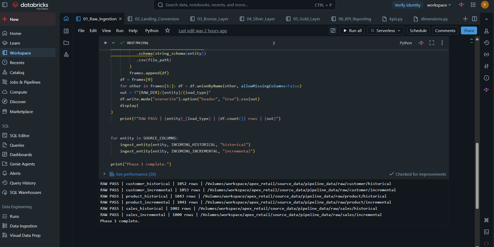

---

# 6. Phase 2: Landing Conversion

## Notebook

```text
notebooks/02_Landing_Conversion.py
```

## Objective

The Landing phase converts the raw inputs into the Landing layer while performing the required reconciliation and audit checks.

The phase validates that the expected source records are present before downstream transformation continues.

## Validation

The Landing phase produced the required reconciliation PASS results for the historical and incremental datasets.

The execution was allowed to continue only after the landing-level reconciliation checks succeeded.

## Evidence

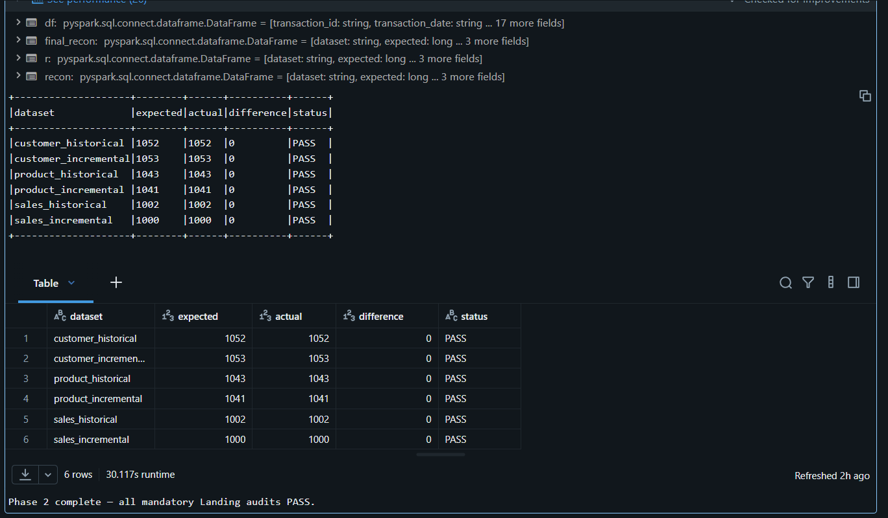

---

# 7. Phase 3: Bronze Layer

## Notebook

```text
notebooks/03_Bronze_Layer.py
```

## Objective

The Bronze layer preserves the Landing data in a structured Delta representation suitable for downstream transformations.

## Processing

The Bronze layer consumes Landing data for:

- Customer
- Product
- Sales

Historical and incremental datasets are processed independently.

## Validation

The Bronze phase completed successfully and produced the required downstream Delta inputs for the Silver layer.

## Evidence

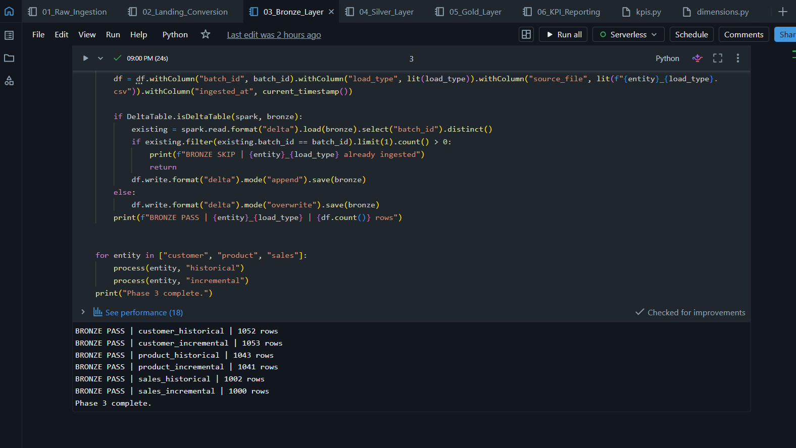

---

# 8. Phase 4: Silver Layer

## Notebook

```text
notebooks/04_Silver_Layer.py
```

## Objective

## Major Silver responsibilities

### Customer

- Historical customer processing.
- Incremental customer processing.
- Data cleaning.
- SCD Type 2 processing.
- Current-state handling.
- Audit/reconciliation validation.

### Product

- Historical processing.
- Incremental processing.
- Data-quality cleaning.
- Product transformation.
- Audit validation.

### Sales

- Historical processing.
- Incremental processing.
- Cleaning and transformation.
- Immutable sales-ledger handling.
- Audit validation.

---

## 8.2 Customer Incremental Audit

The incremental customer dataset contained source rows that required cleaning/deduplication before becoming Silver current-state records.

The executed reconciliation established that the supplied audit expectation represents the source-stage row count, while the cleaned Silver data can contain fewer rows after the defined quality rules are applied.

The final audit logic was adjusted to validate the correct stage semantics rather than disabling the mandatory audit.

### Evidence

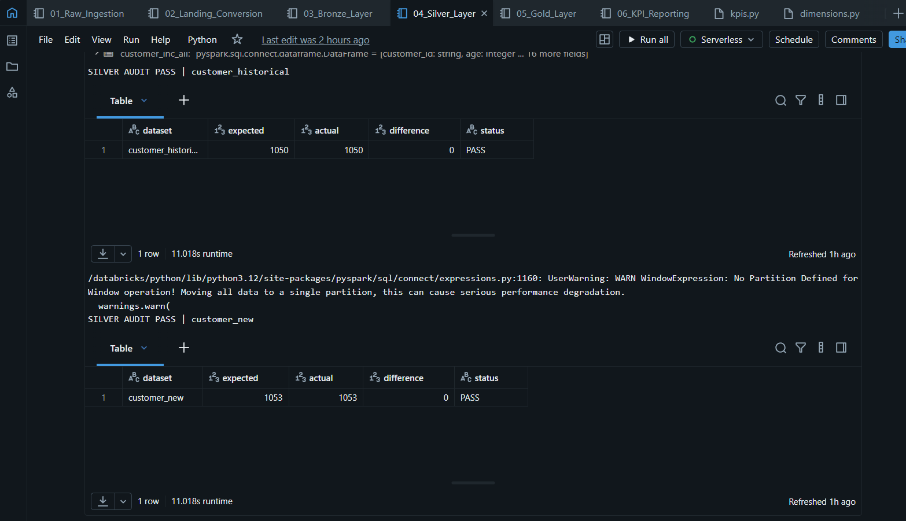

> **Note:** The screenshot filename follows the local evidence naming convention. The repository should retain the screenshot as captured.

---

## 8.3 Product Audit

Product historical and incremental processing completed with successful Silver audit validation.

### Evidence

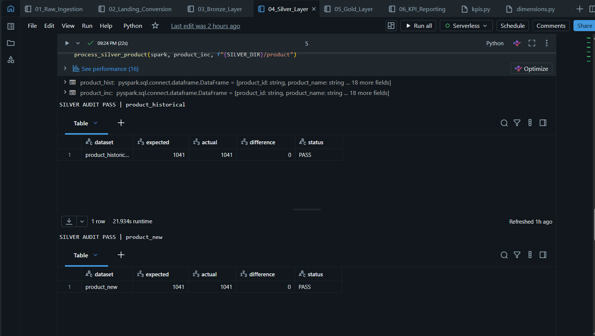

---

## 8.4 Sales Audit

Sales historical and incremental processing completed with successful audit validation.

### Evidence

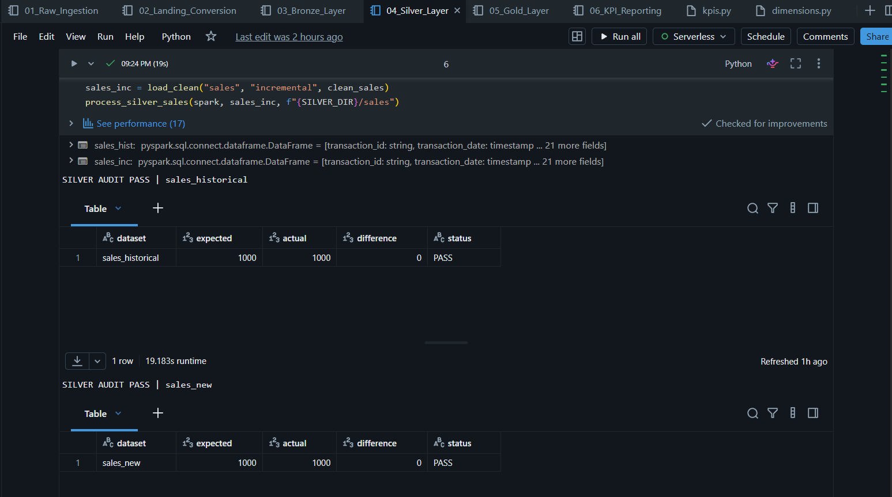

---

## 8.5 Silver Layer Completion

The combined Silver execution evidence demonstrates successful progression through:

```text
Customer → Product → Sales
```

with audit-driven validation rather than bypassing reconciliation checks.

### Evidence

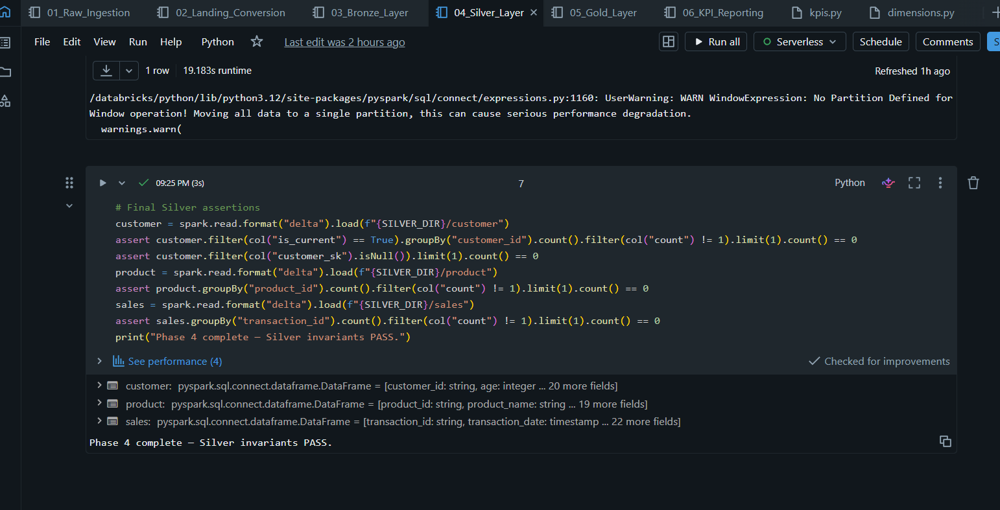

---

# 9. Phase 5: Gold Star Schema

## Notebook

```text
notebooks/05_Gold_Layer.py
```

## Objective

```text
dim_customer
dim_product
dim_promotion
dim_date
fact_sales
```

## 9.1 Dimension and Fact Construction

The Gold phase constructs:

### `dim_customer`

Customer dimension generated from the Silver customer data.

### `dim_product`

Product dimension generated from Silver product data.

### `dim_promotion`

Promotion dimension derived from sales promotion attributes.

### `dim_date`

Date dimension generated from sales transaction dates, including:

- Date key
- Day
- Day of week
- Week of year
- Month
- Month name
- Quarter
- Year
- Weekend indicator

An explicit Unknown member is included to support referential integrity.

### `fact_sales`

Sales fact table built from Silver sales and enriched with dimension surrogate keys.

Unknown-member handling uses:

```text
UNKNOWN_SK = 0
```

for unresolved dimension relationships.

---

## 9.2 Gold Referential Integrity

The Gold execution includes checks to ensure the fact table does not contain unresolved foreign keys represented as nulls.

Validated keys include:

```text
customer_sk
product_sk
promotion_sk
date_sk
```

Unknown-member handling is intentional and uses surrogate key `0`.

---

## 9.3 Gold Execution Result

The Gold tables were successfully constructed as Delta datasets.

### Evidence

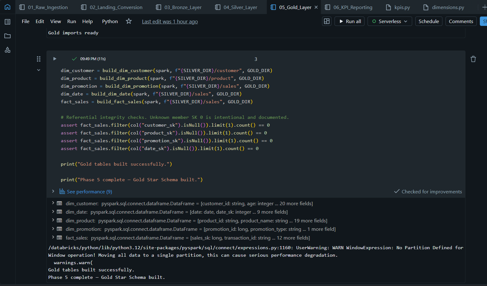

---

# 10. Unity Catalog Registration: Free Edition Exception

## Expected behavior

The original project design included registering the Gold Delta datasets in Unity Catalog using table definitions backed by their storage locations.

## Observed Free Edition limitation

During final execution, the Unity Catalog registration step using a physical `LOCATION` for the Volume-backed Delta datasets was rejected by the Free Edition/serverless environment.

The resulting platform error indicated that the attempted filesystem scheme was not supported for this table-creation path.

The implementation was therefore changed so that **Gold table construction remains the executed deliverable**, while the unsupported external/physical-location registration step is not falsely reported as successful.

## Final handling

The final notebook reports the successful construction of the Gold tables rather than fabricating Unity Catalog registration success.

This preserves the actual project output and keeps the repository technically honest about the capabilities of the execution environment.

> **Important:** This is an execution-environment limitation, not evidence that the Gold transformations failed.

---

# 11. Databricks Free Edition Adaptations

Several changes were required specifically because the final runtime was Databricks Free Edition/serverless.

## 11.1 Serverless / Spark Connect constraints

The Free Edition runtime uses serverless compute and Spark Connect semantics.

Some legacy PySpark patterns used by the original implementation were incompatible with this environment.

Where required, the implementation was adapted to use DataFrame/Spark Connect-compatible operations.

One encountered limitation was:

```text
Using custom code using PySpark RDDs is not allowed on serverless compute
```

The affected logic was rewritten without relying on prohibited RDD operations.

---

## 11.2 Import-path handling

The repository follows a conventional Python package layout:

```text
src/
├── audit/
├── config/
├── gold/
├── quality/
└── silver/
```

Databricks notebook execution does not automatically expose the repository's `src/` directory as a Python import root in the same way as a local development environment.

The final notebooks therefore explicitly add the project `src/` path to `sys.path` before importing project modules.

This allowed imports such as:

```python
from config.paths import ...
from gold.kpis import ...
from silver.sales_logic import ...
```

to resolve during notebook execution.

---

## 11.3 Configuration path adaptation

The final Free Edition runtime uses Volume-backed paths rather than the original Azure workspace-specific storage paths.

The path configuration was centralized through:

```text
src/config/paths.py
```

so that the notebooks do not hard-code the source/data directories independently.

---

## 11.4 Data-access correction

The source-data directory hierarchy was aligned exactly with the paths expected by the ingestion logic.

For example:

```text
incremental_data/
├── customer/
│   └── customer_incremental.csv
├── product/
│   └── product_incremental.csv
└── sales/
    └── sales_incremental.csv
```

This resolved path-level ingestion failures without changing the source filenames.

---

## 11.5 Gold schema compatibility corrections

The Gold date dimension required an explicit schema for the Unknown member because the Free Edition runtime could not reliably infer the schema from an all-`None`/mixed-value row.

An explicit `StructType` was therefore used for the Unknown date member.

The final date dimension also includes the required `year` field.

---

## 11.6 Fact-table join corrections

The Gold fact-building logic was adjusted to avoid Spark Connect alias-resolution and expression-precedence issues.

The final implementation explicitly selects the required columns from the dimension datasets before joining and uses explicit DataFrame references for customer, product, and promotion keys.

This avoids ambiguous or unresolved-column behavior during serverless execution.

---

# 12. Phase 6 — KPI Reporting

## Notebook

```text
notebooks/06_KPI_Reporting.py
```

## Objective

---

# 13. KPI 1 — Net Margin by Region

## Definition

Net margin follows the assignment definition:

```text
gross revenue - discount applied
```

grouped by store region/location.

## Implementation

```python
kpi1 = net_margin_by_region(fact)
display(kpi1)
```

## Output

The final execution produced the expected grouped result by:

```text
store_location
```

with gross revenue, discount amount, transaction count, and calculated net margin.

### Evidence

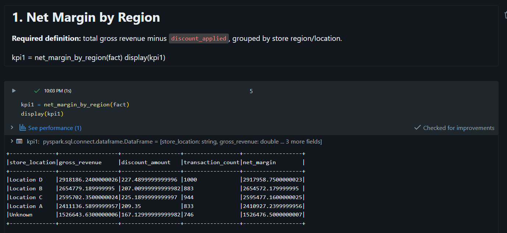

---

# 14. KPI 2 — Average Order Value by Promotion

## Definition

Average Order Value is calculated as the observed average:

```text
total_sales per transaction
```

grouped by promotion type.

## Implementation

```python
kpi2 = aov_by_promotion(fact, promotions)
display(kpi2)
```

The implementation uses the `promotion_type` already present in the Gold fact dataset, avoiding an unnecessary join that caused ambiguous promotion-column resolution in Spark Connect.

### Evidence


---

# 15. KPI 3 — Demographic Churn Heatmap

## Definition

Churn rate is calculated from the supplied `churned` field and grouped by:

```text
customer_state
loyalty_program
```

The KPI uses the current customer dimension records.

## Implementation

```python
kpi3 = churn_heatmap(customers)
display(kpi3)
```

### Evidence

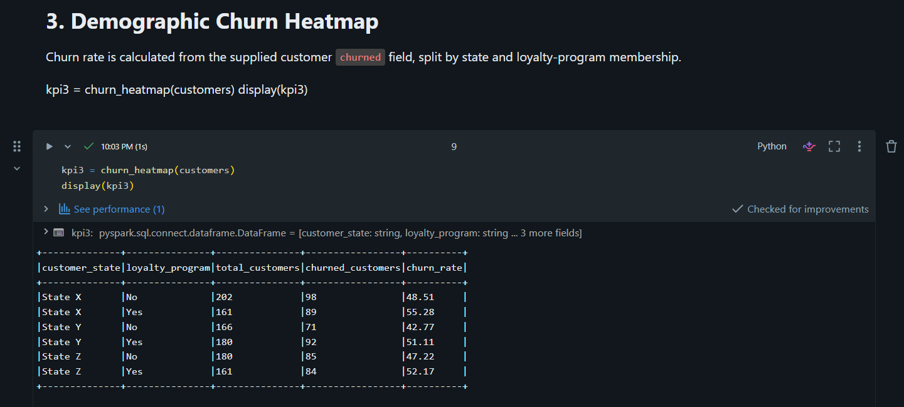

---

# 16. KPI 4 — Product Quality Index

## Definition

The assignment defines this KPI around identifying categories with the highest return rates.

The implementation therefore uses the supplied:

```text
product_return_rate
```

rather than inventing a composite quality formula.

## Implementation

```python
kpi4 = product_quality(products)
display(kpi4)
```

### Evidence

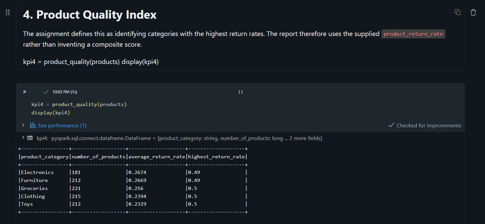

---

# 17. KPI 5 — Store Traffic by Hour

## Definition

The supplied data contains transaction activity rather than physical store-footfall measurements.

Therefore, transaction count is used as the observable traffic proxy.

The result is grouped by:

```text
store_location
day_of_week
transaction_hour
```

and also reports average transaction value.

## Implementation

```python
kpi5 = store_traffic_proxy(fact)
display(kpi5)
```

### Evidence

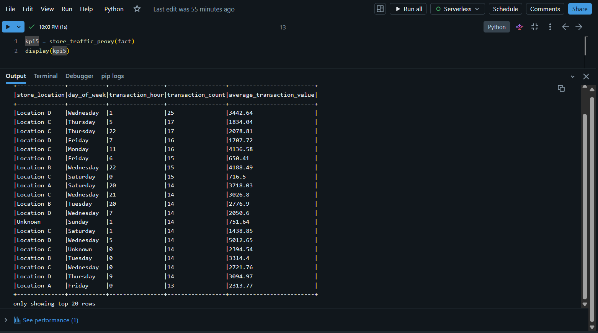

---

# 18. KPI Reporting Limitations

The following interpretations are intentionally descriptive.

## Net Margin

The project follows the assignment formula:

```text
gross revenue - discount applied
```

This is **not** a complete accounting profit-after-cost calculation.

## Store Traffic

Actual physical footfall is not included in the supplied dataset.

Transaction volume is therefore used as the traffic proxy.

## Churn

Churn uses the supplied `churned` field and does not attempt to infer churn from behavioral heuristics.

## AOV

Average Order Value is observational and descriptive. It should not be interpreted as evidence that a promotion caused higher or lower order values.

---

# 19. Data Quality and Audit Philosophy

The project intentionally treats reconciliation and validation as part of the pipeline rather than as optional diagnostics.

Validation is performed at multiple layers:

```text
Raw
 ↓
Landing reconciliation
 ↓
Bronze persistence
 ↓
Silver cleaning + audits + SCD2
 ↓
Gold referential integrity
 ↓
KPI reporting
```

The pipeline does not simply suppress validation failures to force completion.

During development, several source-stage versus cleaned-stage row-count differences were identified. These were investigated and corrected at the appropriate transformation/audit boundary rather than disabling mandatory audits.

---

# 20. Development vs Final Execution Cleanup

During debugging, temporary notebook cells were used to inspect:

- Source file paths.
- CSV headers.
- Raw and cleaned row counts.
- Audit records.
- Dimension schemas.
- Spark/session behavior.

These cells were used only for diagnosis.

Before repository submission:

- Temporary diagnostics were removed from the final notebook implementation.
- Production logic was kept in `src/`.
- Notebook files were aligned with the working execution versions.
- Empty placeholder packages were removed where no implementation existed.
- Supplied source datasets were kept outside the public repository.
- Runtime configuration was centralized.

---

# 21. Known Platform-Specific Exceptions

The following deviations should be understood when reproducing the project in another environment.

| Area | Final behavior |
|---|---|
| Compute | Databricks Free Edition serverless |
| RDD-based code | Reworked where unsupported |
| Source paths | Volume-backed Free Edition paths |
| Python imports | `src/` explicitly added to `sys.path` |
| Gold schema registration | Physical-location Unity Catalog registration not completed in Free Edition |
| Gold data | Successfully written as Delta |
| KPI output | Successfully executed directly in Databricks |
| Source CSVs | Kept outside public repository |

A fully provisioned Azure/paid Databricks environment may allow additional catalog/storage integration patterns that are unavailable in Free Edition.

---

# 22. Reproducibility

To reproduce the project:

1. Create a Databricks environment with the required serverless/Spark capabilities.
2. Create a writable Volume.
3. Upload all supplied CSV and audit inputs following the structure in `datasets/README.md`.
4. Configure the environment variables described in `config.env.example`.
5. Ensure the notebook can import the repository's `src/` package.
6. Execute notebooks in order:

```text
01_Raw_Ingestion.py
02_Landing_Conversion.py
03_Bronze_Layer.py
04_Silver_Layer.py
05_Gold_Layer.py
06_KPI_Reporting.py
```

7. Confirm reconciliation and audit outputs at each phase.
8. Confirm Gold Delta datasets were produced.
9. Execute all five KPI sections.

---

# 23. Evidence Index

The complete evidence set included in this repository is:

| # | Evidence | File |
|---|---|---|
| 1 | Raw ingestion | `01_raw_ingestion.png` |
| 2 | Landing conversion | `02_landing_conversion.png` |
| 3 | Bronze layer | `03_bronze_layer.png` |
| 4 | Silver customer audit | `04_0_silver_audit_pass_customer.png` |
| 5 | Silver product audit | `04_1_silver_audit_pass_product.png` |
| 6 | Silver sales audit | `04_2_silver_audit_pass_sales.png` |
| 7 | Silver layer | `04_3_silver_layer.png` |
| 8 | Gold star schema | `05_gold_star_schema.png` |
| 9 | KPI — Net Margin | `06_kpi_net_margin.png` |
| 10 | KPI — AOV Promotion | `07_aov_promotion.png` |
| 11 | KPI — Churn Heatmap | `08_kpi_churn_heatmap.png` |
| 12 | KPI — Product Quality | `09_kpi_product_quality.png` |
| 13 | KPI — Store Traffic | `10_kpi_store_traffic.png` |

---

# 24. Final Status

| Component | Status |
|---|---|
| Raw ingestion | PASS |
| Landing conversion | PASS |
| Bronze layer | PASS |
| Silver layer | PASS |
| Gold Star Schema | PASS |
| KPI reporting | PASS |
| Landing reconciliation | PASS |
| Silver audits | PASS |
| SCD / duplicate validation | PASS |
| Gold referential checks | PASS |
| Five mandatory KPIs | PASS |
| Unity Catalog physical-location registration in Free Edition | LIMITATION |

The Unity Catalog registration limitation is documented explicitly and was not reported as successful.
---

# 25. Conclusion

The Apex Retail Intelligence pipeline was successfully implemented as a layered Databricks/PySpark data engineering workflow with:

- Structured batch ingestion.
- Landing and Bronze persistence.
- Silver data-quality processing.
- SCD Type 2 customer handling.
- Audit and reconciliation controls.
- Gold Star Schema construction.
- Direct KPI reporting in Databricks.
- Evidence-backed execution documentation.

The repository separates implementation, runtime input data, execution evidence, and project documentation for reproducible review.
